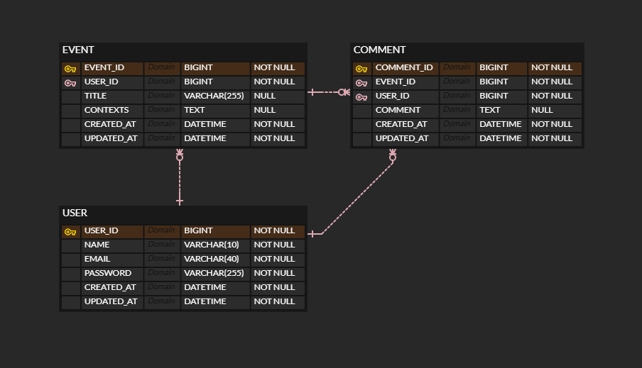

# 캘린더 V2

## API 명세
### 일정
#### 등록

- Method : POST
- URI:/event
- Request
    - PathVariable : 없음
    - RequestBody :

      |   | 이름      | 타입     | 필수여부 | 설명       |
      |---|---------| ------ |------|----------|
      | 1 | title   | String | 필수   | 일정 제목    |
      | 2 | contexts | String | 선택   | 일정 세부 내용 |
      | 3 | userName | String | 필수   | 사용자 이름   |

- Response

    |   | 이름       | 타입     | 필수여부 | 설명       |
    |---|----------| ------ |------|----------|
    | 1 | title    | String | 필수   | 일정 제목    |
    | 2 | contexts | String | 선택   | 일정 세부 내용 |
    | 3 | userName | String | 필수   | 사용자 이름   |

      

- Exception (Response Header) :

  | 에러 코드 | 에러 메세지       |
        | ----- |--------------|
  | 400   | 필수 필드 누락입니다. |

### 공통 에러코드

| 에러 코드 |
|-------|
| 500   |

## ERD
